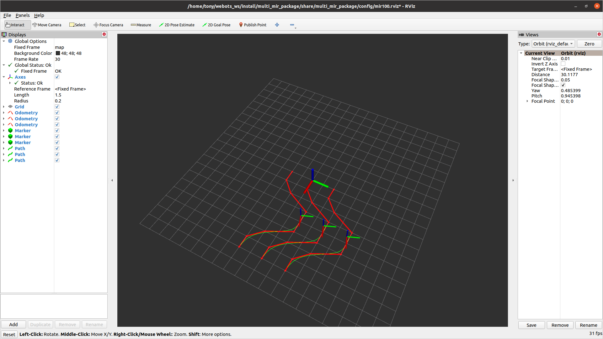

# Swarm intelligence

This work combines the MARL algorithm with the MPC algorithm to achieve multi-agent swarm intelligence.

## Environment

Gym 0.25.2

Ubuntu 20.04

ROS2 foxy

Webots 2023a

## Start single robot simulation
```
ros2 launch my_mir_package robot_mir_launch.py
```
## Start multi robots simulation
```
ros2 launch multi_mir_package multi_mir_launch.py 
```
## Data plot

Firstly, run the simulation program, and the trajectory data will be automatically saved in a .txt file.

The, get in src/, run:

```
python3 result_plot.py
```




